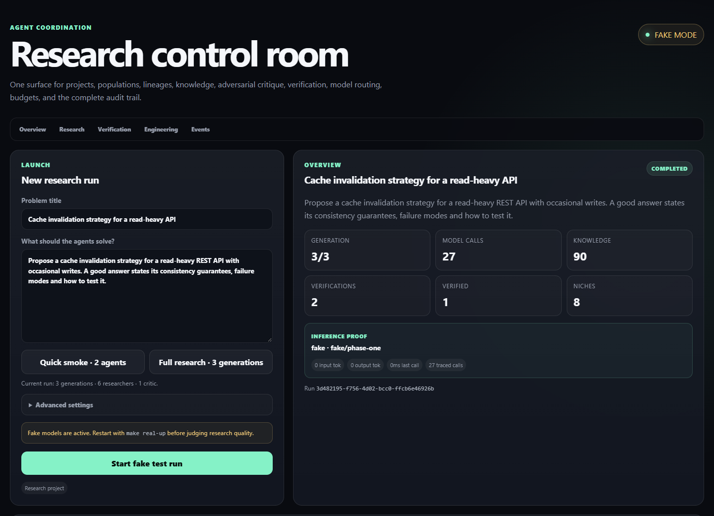
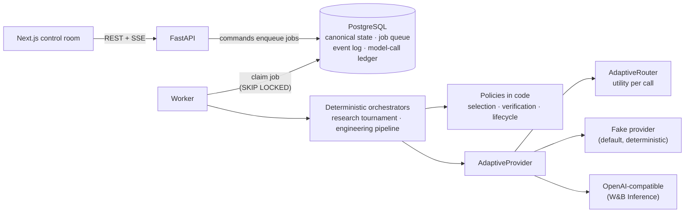

# Agent Coordination

[](https://github.com/BestMiraPro/Agent-coordination/actions/workflows/ci.yml)

A durable multi-agent **research lab** and **engineering pipeline**. LLMs
generate candidate answers and code. Deterministic Python code runs the
workflow: it picks the survivors, decides what counts as verified, routes
each call to a model, and records every decision in PostgreSQL.

> **Models propose; deterministic code owns orchestration and verification state.**

**Why it exists.** Most multi-agent setups spawn a few agents, let them talk,
and take the consensus. That breaks in familiar ways:

- correlated models agree on the same wrong answer;
- populations converge on one idea;
- a crash loses the work;
- nobody can say what a result cost or why it won.

This project treats every model call as an unreliable, costly proposal. The
control plane (state transitions, selection, verification verdicts, retries,
routing) lives in ordinary code that can be tested and audited.

**What is technically interesting**

- **Deterministic control plane.** Run, agent and candidate state machines,
  survivor selection, lineage and verdicts are code paths, never free-form LLM
  decisions. Model output is parsed into typed structures, and the raw text is
  kept alongside.
- **Verification outranks consensus.** Judge scores rank candidates, but they
  can never mark one `VERIFIED`. Verdicts come from checks with veto
  semantics. The checks are still shallow, and
  [the boundary is documented below](#verification-what-it-does-and-does-not-do).
- **Selection that resists collapse.** Judges are blind (candidates get opaque
  labels) and score several dimensions, with no single fitness scalar. Each
  generation reserves an elite, a novelty and a wildcard survivor slot, and
  near-duplicate branches are filtered out.
- **Durable, auditable execution.** The job queue lives in PostgreSQL
  (`FOR UPDATE SKIP LOCKED`, idempotency keys, backoff, lease recovery). There
  is an append-only event log, and every model call gets a row with latency,
  tokens and the routing decision.
- **Model-agnostic, cost-aware routing.** A utility function routes each call,
  trading expected quality and reliability against cost, credits, latency,
  scarcity and rate-limit pressure.
- **Two policies, one substrate.** An evolutionary research tournament and a
  plan → implement → test → review engineering pipeline share the queue,
  providers and router. They do not share selection policy.

**Run it without an API key**

```bash
docker compose up --build
```

Open <http://localhost:3000>, choose **Full research · 3 generations**, and
press **Start fake test run**. The worker defaults to a deterministic fake
provider, so the whole workflow runs end to end with no credentials:
populations, blind judging, selection, critics, verification, memory and
routing telemetry. To use real models, see [Real inference](#real-inference).



<sub>The control room after a three-generation run on the deterministic fake
provider. The fake provider proves the orchestration, not research quality.</sub>

---

## Architecture



The system is a modular monolith. [ADR-0001](docs/adr/0001-modular-monolith.md)
explains why PostgreSQL serves as both the canonical store and the queue
instead of adding Redis, Celery or Temporal. Dependencies point inward:
`packages/core` imports no FastAPI, SQLAlchemy, HTTP client or model vendor.
It talks to storage and queues only through the ports in
`packages/core/ports`.

| Path | Responsibility |
| --- | --- |
| `packages/core/orchestration` | Research tournament state machine and selection policy |
| `packages/core/verification` | Verification engine and verdict combination |
| `packages/core/routing` | Adaptive model router |
| `packages/core/research` | Typed research memory and knowledge extraction |
| `packages/core/engineering` | Engineering pipeline and static artifact checks |
| `packages/providers` | Fake, OpenAI-compatible and routed providers |
| `packages/persistence` | SQLAlchemy repositories, durable job queue, Alembic migrations |
| `services/api` | FastAPI commands, queries and SSE event stream |
| `services/worker` | Job loop, handlers, model-call accounting |
| `apps/web` | Next.js control room |

## Research workflow

Each generation runs this loop:

```text
problem
 -> researchers assigned to explicit niches        (constructive, skeptical, counterexample, ...)
 -> structured JSON submissions                    (claims, evidence, discoveries, failed attempts)
 -> blind judges + dedicated adversarial critics   (opaque labels, multidimensional scores)
 -> novelty / redundancy analysis
 -> survivor selection: elite · novelty · wildcard
 -> knowledge extracted into typed memory
 -> next generation: cloned mutations with targeted cross-pollination,
    plus fresh explorers that see none of it
 -> final verification -> VERIFIED / REFUTED / inconclusive
```

- **Ranking** is lexicographic, not a weighted sum: fatal errors come first,
  then correctness, rigor, research progress, verifiability, novelty and judge
  confidence.
- **Survivors.** One slot always goes to the strongest viable branch (elite),
  one to the most novel (novelty) and one to a deterministic wildcard. Any
  remaining slots are filled by quality. A branch whose similarity to an
  existing survivor is above the redundancy threshold is skipped whenever an
  alternative exists. Branches that are fatal or refuted by a critic are
  excluded while non-fatal alternatives exist.
- **Novelty** is `1 − max similarity` to the other submissions, where
  similarity is token-set Jaccard. It is lexical, cheap and deterministic, not
  semantic.
- **Mutations.** Cloned children inherit a parent and a mutation objective
  (`STRENGTHEN`, `FALSIFY`, `REDERIVE` or `GENERALIZE`), and lineage is stored.
- **Memory.** Agents are disposable, but knowledge survives them. Findings are
  stored as typed items (`VERIFIED_FACT`, `HYPOTHESIS`, `COUNTEREXAMPLE`,
  `FAILED_APPROACH`, ...).
- **Cross-pollination is targeted.** Each agent receives a specific packet of
  verified, promising, refuted or open items rather than a broadcast of
  everything.
- **Fresh explorers** receive no parents, memory or packets. They guard
  against blind spots the whole population has inherited.

Defaults in the control room: 3 generations, a population of 6, 3 survivors,
1 fresh explorer per later generation, 2 judges and 1 critic, a redundancy
threshold of 0.78, and final verification enabled.

## Engineering workflow

```text
objective
 -> planner
 -> primary implementer + test specialist
 -> deterministic artifact checks
 -> system reviewer
 -> bounded repair loop  ->  re-test + re-review
 -> completed / failed
```

This pipeline reuses the durable queue, provider abstraction, router,
retries and model-call accounting. It does not use the tournament's selection
policy: engineering needs one correct, reviewed change, not a diverse
population. Each stage transition is an idempotent job in the same PostgreSQL
queue.

## Verification: what it does and does not do

The design claim is structural. A verdict is computed by code from explicit
check results, and judge agreement cannot produce one.

| Combined check results | Verdict | Candidate lifecycle |
| --- | --- | --- |
| any check `FAILED` | `FAILED` | `REFUTED` |
| every check `PASSED` | `PASSED` | `VERIFIED` |
| anything else | `INCONCLUSIVE` | not promoted |

The checks available today are deliberately modest:

| Check | Establishes | Does **not** establish |
| --- | --- | --- |
| Critic survival | A dedicated adversarial critic reported no fatal error | Correctness. Critics are models, so this is adversarial review, not proof |
| Structured support | There is an explicit final answer, and every claim has a non-empty `support` field | That the support is true |
| Python syntax | Embedded Python blocks compile | That the code runs or is correct. Nothing is executed |

In this repository, `VERIFIED` means "passed the configured deterministic
gate". It does **not** mean formally proven or empirically tested. The
verifier interface is designed for stronger adapters (sandboxed test
execution, solvers, proof assistants, source retrieval). None of those exist
yet, and none are silently emulated.

The engineering pipeline follows the same rule. It checks that artifacts
exist, that paths are safe, relative and unique, that Python compiles, that
JSON parses and that a test artifact is present. It **does not execute
model-generated code on the worker host**. Real test execution should run in
an isolated, disposable sandbox rather than weaken that boundary.

## Adaptive model routing

The router scores every enabled model that has free capacity and picks the
highest utility:

```text
            quality[task] × (1 − failure_rate) × task_value × concurrency_bonus
utility = ───────────────────────────────────────────────────────────────────────
           0.05 + cash_cost + 0.35·credits + 0.08·latency_s + 0.8·scarcity + 0.8·rate_limit_pressure
```

Ties break deterministically on failure rate, then latency, then ID.

- **Learned online:** failure rate (EWMA, α = 0.1) and latency (EWMA,
  α = 0.2), updated after every model call and persisted.
- **Priors:** task quality, cash and credit cost, scarcity, rate-limit
  pressure and concurrency. The configured primary model starts at a quality
  of about 0.70. Models found through catalog discovery start at a neutral
  0.50, so a new model is never assumed superior before there is evidence.
- **Observable:** the router's state is available at `GET /model-states`, and
  every model call records the routed profile and its utility.
- **Current limits:** a running worker routes on the model state it loaded at
  startup. Persisted observations take effect on the next start. The weights
  are hand-set and have not been benchmarked.

The claim is that the cost/quality/latency trade-off is explicit,
inspectable and replaceable. It is **not** that the router is economically
optimal. Adding provider routes does not require changes to tournament or
engineering orchestration.

## Real inference

The production provider speaks the OpenAI-compatible chat-completions API.
[W&B Inference](docs/wandb-inference.md) is the configured example. Copy
`.env.example` to `.env` and set:

```bash
INFERENCE_PROVIDER=wandb
WANDB_API_KEY=<your W&B API key>
INFERENCE_MODEL=openai/gpt-oss-20b
INFERENCE_DISCOVER_MODELS=true
```

Then run `make real-up`. To check the credential and one live call first,
run `make wandb-smoke`.

- With discovery enabled, worker startup authenticates against `GET /models`
  and registers the account's available models with neutral routing priors.
- `INFERENCE_API_KEY` is the vendor-neutral alternative.
- API keys are read from the environment only. They are never persisted in
  model profiles, model calls, events or run state.

## Development

```bash
python -m pip install -e ".[dev]"
docker compose up -d postgres
alembic upgrade head
make api        # terminal 1
make worker     # terminal 2
cd apps/web && npm install && npm run dev   # terminal 3
```

Quality gates, all enforced in CI:

```bash
ruff check .
pytest -q                      # PostgreSQL integration tests need TEST_DATABASE_URL
cd apps/web && npm run build
docker compose config --quiet
```

CI runs against a real PostgreSQL service. It validates Compose, lints,
applies every Alembic migration, runs the unit, integration, provider-contract
and eval tests, and builds the production control room.

## Design invariants

- Deterministic code owns orchestration and verification state.
- Blind judges never see model identity.
- Selection never collapses to one scalar fitness score.
- Diversity is protected without treating novelty as correctness.
- Agents die; knowledge survives.
- Cross-pollination is targeted, not all-to-all.
- Critic and refutation state affects later selection.
- Verification outranks consensus.
- Routing accounts for quality, cost, latency, scarcity and reliability.
- Research and engineering share infrastructure but use different policies.
- Untrusted generated code is never executed on the worker host.

## Status and limitations

This is a working architecture at MVP scale, not a hosted product.

- **Local development only.** The API and control room have no
  authentication, and Compose uses fixed local database credentials. Do not
  expose it to a network as-is.
- **The fake provider** proves orchestration, persistence and UI end to end.
  It says nothing about research quality.
- **Verification and routing** have the limits described above.
- **Novelty** is lexical similarity, not embeddings.

[`docs/`](docs/README.md) contains the architecture decision record, the W&B
setup notes, and the phase-by-phase design history this was built from.
